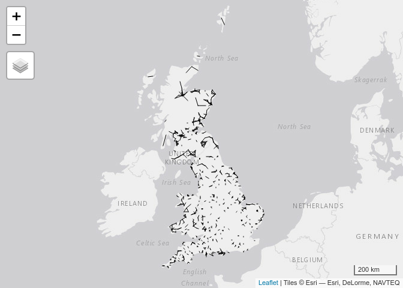
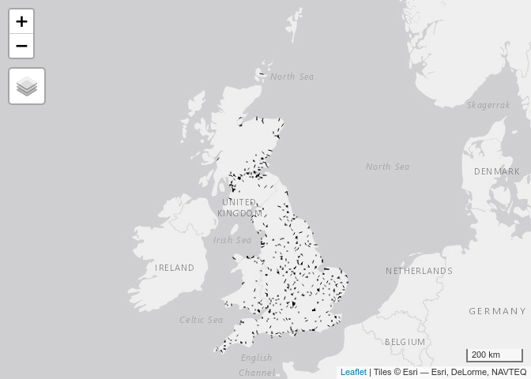

# NTEM2OD

This repo contains scripts and (in the releases) data to convert the
National Trip Ends Model (NTEM) into an Origin-Destination (OD) Matrix.

<!-- README.md is generated from README.Rmd. Please edit that file -->

After downloading test datasets and loading the `tidyverse` you should
be able to run the following to test the outputs, as geographic ‘desire
lines’ between zone (MSOA) centroids:

``` r
desire_lines_top_drive = sf::read_sf("desire_lines_top_drive.geojson")
desire_lines_top_drive %>% 
  qtm()
```

<!-- -->

``` r
desire_lines_top_cycle = sf::read_sf("desire_lines_top_cycle.geojson")
desire_lines_top_cycle %>% 
  qtm()
```

<!-- -->
